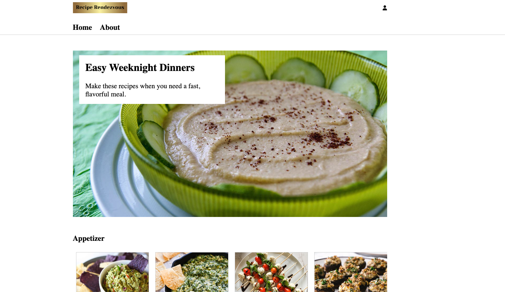
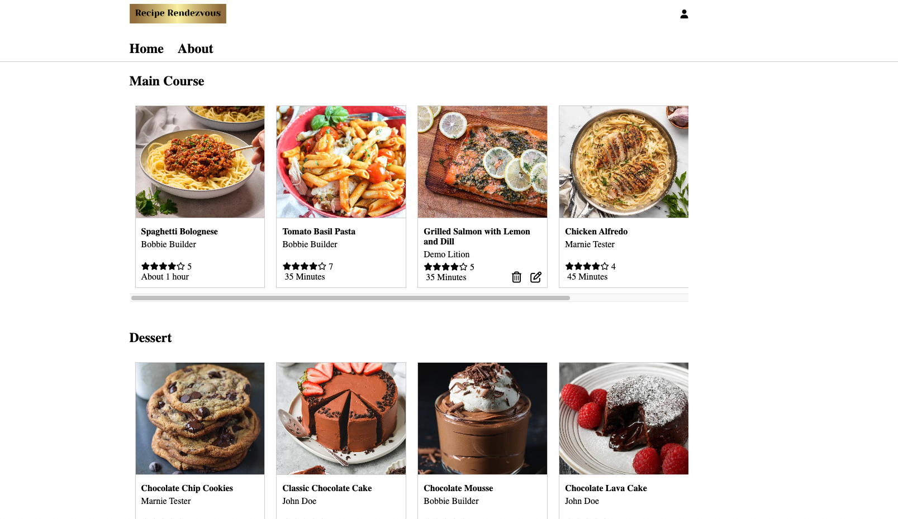
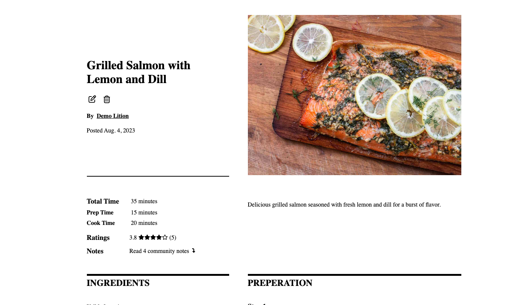
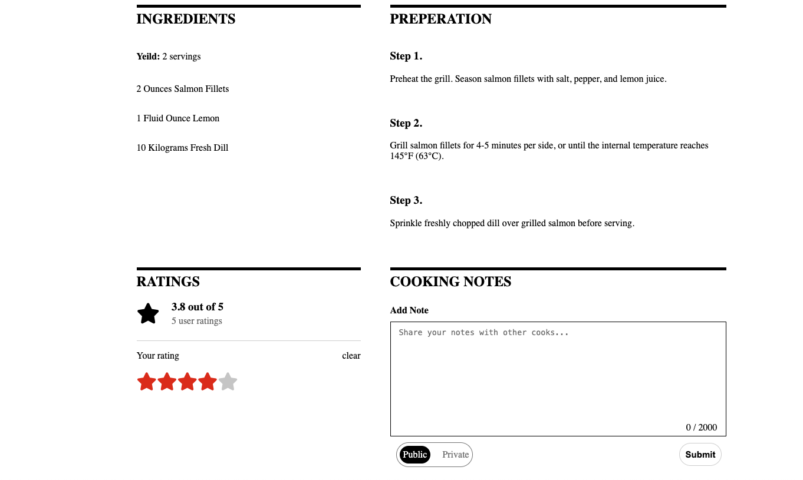
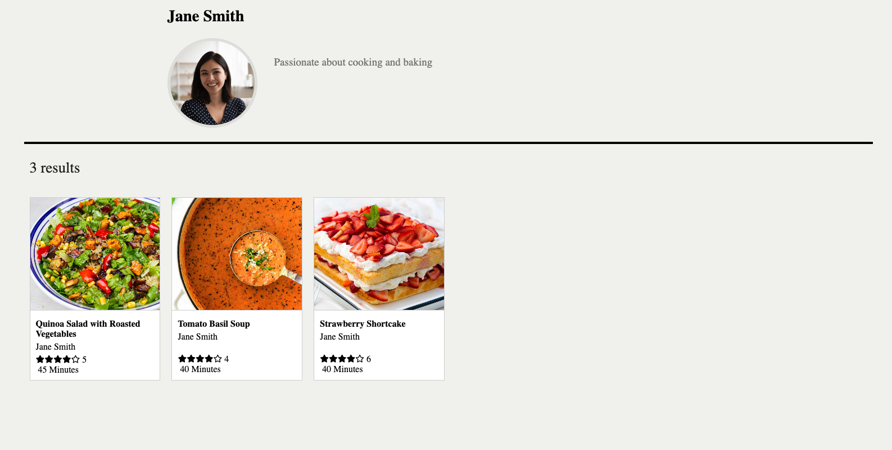

## Recipe Rendezvous
Recipe Rendezvous is my take on the popular recipe sharing site [The New York Times Cooking](https://cooking.nytimes.com/).  Recipe Rendezvous allows users to create and share recipes that they've found or created with other users, friends and family. As well as share their thoughts and opinions on recipes that they've tried. [Click here to check out Recipe Rendezvous!](https://recipe-rendezvous.onrender.com/)

## Wiki Links
- [API Routes](https://github.com/Promingy/Capstone/wiki/API-ROUTES)
- [Database Schema](https://github.com/Promingy/Capstone/wiki/DB-Schema)
- [User Stories](https://github.com/Promingy/Capstone/wiki/User-Stories)
- [Feature List](https://github.com/Promingy/Capstone/wiki/Features)

## Getting Started
- Clone the "main" branch of this repository.
- Install the dependencies with the following command
  ```bash
   pipenv install -r requirements.txt
   ```
	 to generate a new requirements.txt run ` pipenv install requirements > requirements.txt`
- Create a .env file based on the example with proper settings for your development environment
- Ensure that the SQLite3 database connection URL is in the .env file
- This starter organizes all tables inside the `flask_schema` schema, defined by the `SCHEMA` environment variable. Replace the value for `SCHEMA` with a unique name, **making sure you use the snake_case convention.**
- Get into your pipenv, migrate your database, seed your database and run your Flask app:
``` bash
pipenv run flask db migrate
```
``` bash
pipenv run flask db upgrade
```
``` bash
pipenv run flask seed all
```
```bash
pipenv run flask run
```
- To run the React frontend in development, `cd` into the **react-vite** directory and run `npm i` to install dependencies. Next, run `npm run build` to create the `dist` folder. The starter has modified the `npm run build` command to include the `--watch` flag. This flag will rebuild the **dist** folder whenever you change your code, keeping the production version up to date. Finally, run ` npm run dev` to open the application on the local browser.

## Languages and Technologies
- JavaScript
- HTML5
- CSS3
- Python
- Flask
- PostgreSQL
- React
- Redux
- AWS

## Images
### Home Page



### Single Recipe Page



### User Recipes Page



## Future Features
- Your Recipe Box: Your Recipe Box gives you a place to easily view and revisit recipes that you've previously save
- Folders: Folders go hand in hand with Your Recipe Box. Folders give you the ability to save your recipes to folders that you've previously created, allowing for a greater level of organization.
